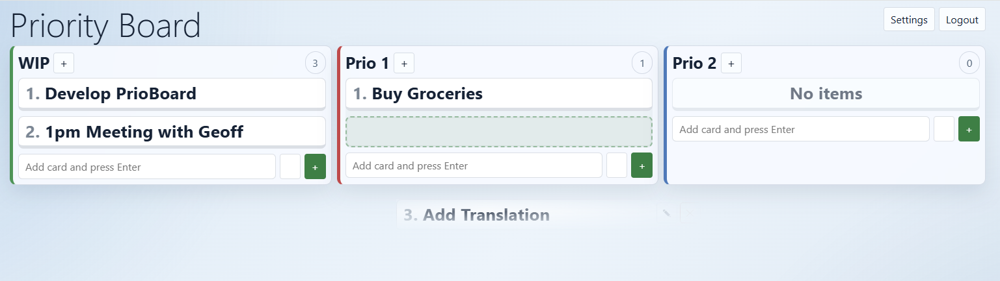

# PrioBoard App
## Kanban based Taskboard with priority, focus, and simplicity in mind.

Priority Board (PrioBoard) is a simple, open-source Kanban like taskboard app to keep track of your work. Priority Board is a free and opensource app for self-hosted webserver, Raspberry-Pi, or similar.



## Requirements

- Webserver with PHP 8.2 or newer
- Composer (local dev environment)
- PHP extensions: `ctype`, `iconv`, `pdo_sqlite`

# Setup (Prod Environment)
Prepare and run the following commands:

```bash
composer install --no-dev --optimize-autoloader
cp .env .env.local
php bin/console doctrine:migrations:migrate
```

Edit `.env.local` or `.env.prod.local`:

```dotenv
APP_ENV=prod
APP_DEBUG=0
APP_SECRET=change-this-to-a-long-random-value-min-32-chars-long
#APP_SECRET=8f4b7b1c9d2e6a3f0c8b9a1d7e5f2c4a <= Good example
```

Optional production optimization:

```bash
composer dump-env prod
```

The web server must point to the `public/` folder.

More deployment info can be found here:
https://symfony.com/doc/current/deployment.html#symfony-deployment-basics

## Database

By default, the app uses SQLite at `var/data_prod.db`.
Feel free to change it to MySQL or Maria DB.

## First Login

On a fresh database, one admin account is created automatically:

- Username: `admin`
- Password: `admin`

Log in, open `Settings`, and change the login immediately.

# Run Locally

```bash
php -S 127.0.0.1:8000 -t public
```

Then open `http://127.0.0.1:8000`.

If you use Symfony CLI, you can also run:

```bash
symfony server:start
```

# Use The App

- Open the board to view cards.
- Log in to add, edit, move, color, or delete cards.
- Use `Settings` to change the style, font size, refresh interval, login, and API key.
- Public users can view the board without logging in.

## Login And API

- Login uses Symfony form login.
- There is one local admin user.
- There is no registration, OAuth, LDAP, or multi-user setup.
- Passwords are hashed by Symfony.
- API reads are public: `GET /api/board`.
- API writes need the `X-API-Key` header. Generate the key in `Settings`.

## How It's Built

- Symfony 7.4
- Twig templates
- Doctrine ORM
- SQLite by default
- Symfony Asset Mapper and Stimulus

# License

PrioBoard is free and opensource. It is released under the MIT License. See `LICENSE`.
